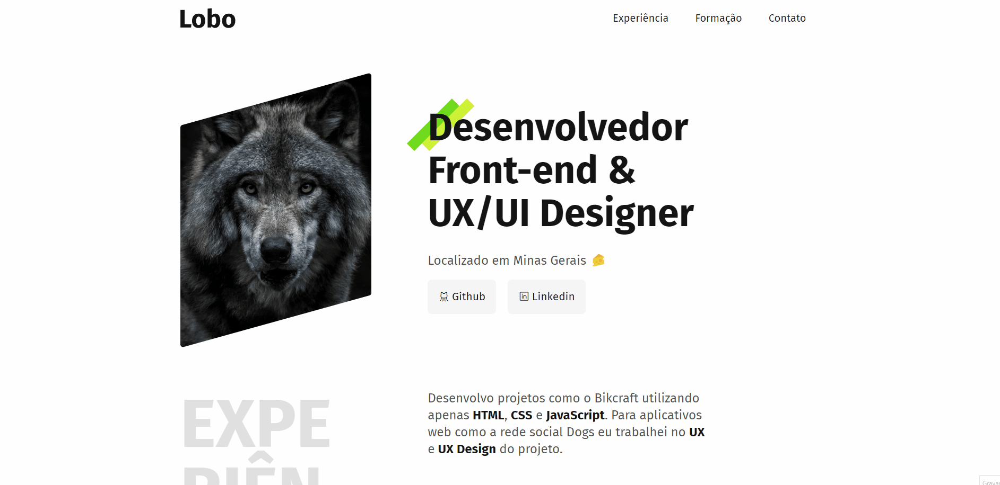
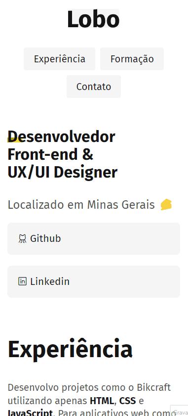

<h1 align="center"></h1>

## Origamid Portfolio Made During Beginner's HTML and CSS Course

 <a href="#computer-about-project">About</a> •
 <a href="#art-layout">Layout</a> • 
 <a href="clipboard-online-page">Online page</a> • 
 <a href="#rocket-technologies">Technologies</a> • 
 <a href="#memo-license">Licença</a> • 
 <a href="dart-author">Autor</a>

### :computer: About Project
In this Module we learn to create responsive websites with full accessibility for screen readers using positioning such as flexbox and grid

I practiced and studied:
- Accessibility

- Flexible units

- Grid Concepts

- Content positioning

- accessible typographies

- Responsive Mobile and Desktop

---

### :art: Layout
### Desktop

### Mobile

---

### :clipboard: Online page
Just access the link: <a href="https://filipedev8.github.io/portfolio-origamid/" target="_blank">Portfolio</a>

---

### :rocket: Technologies

 

---

### :dart: Author

	Made with by Filipe Rodrigues👋 Get in touch!

    

---

### :memo: License

This project is under the MIT license. See the [LICENSE](LICENSE) for more information.
